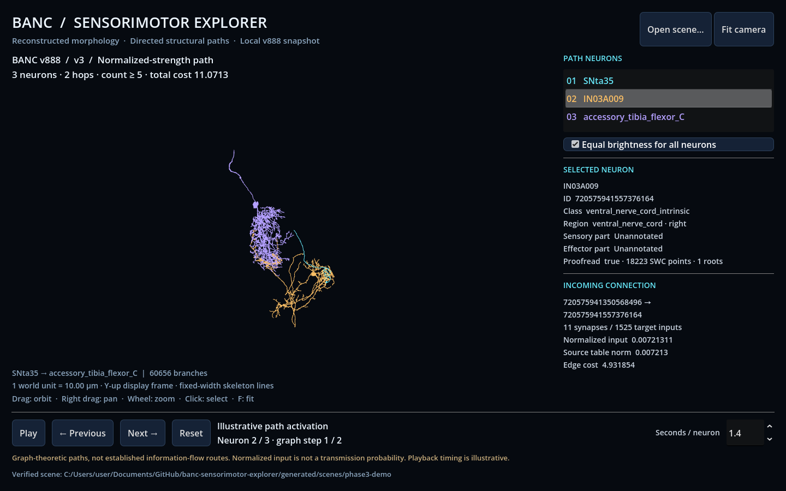
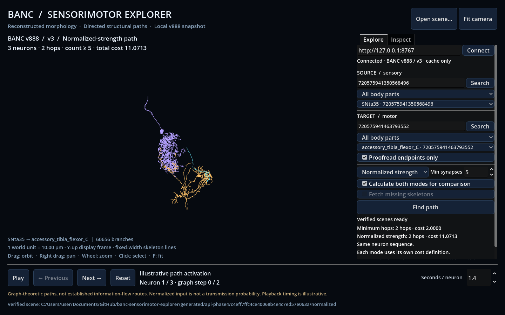

# BANC Sensorimotor Explorer

A local research prototype for exploring graph-theoretic sensory-to-motor paths
in the adult female Drosophila BANC brain-and-nerve-cord connectome.

**Current milestone: Phase 5 — optional brain/VNC spatial context.**
Public data preparation, candidate lookup, minimum-hop and normalized-strength
paths, provenance-bearing JSON, and real SWC scene exports work. Godot displays
selected reconstructed neurons with orbit/pan/zoom, selection metadata, real edge
values and illustrative activation playback. The optional localhost API lets you
search/select sensory and motor neurons, calculate both path modes, and reload
their 3D scenes directly from Godot. Optional public neuropil outlines now provide
spatial context with independent source provenance. The file-only workflow remains available.

See [brain/VNC context setup, provenance and screenshot](docs/context.md) for
`morphology context-fetch`, `scene export --include-context`, and the UI controls.

## Setup (PowerShell)

Install Python 3.11/3.12 and [uv](https://docs.astral.sh/uv/getting-started/installation/),
then run from the repository root:

```powershell
uv sync --locked
uv run banc-explorer data prepare --metadata-only
uv run banc-explorer candidates sensory --limit 5
uv run banc-explorer data prepare
uv run banc-explorer data validate --output generated/data-validation.json
uv run banc-explorer candidates motor --body-part leg --limit 5
uv run banc-explorer demo build
uv run pytest
uv run ruff check .
```

This workspace already has a local uv executable at `.tools/bin/uv.exe` and an
initialized `.venv`. If uv is not on PATH, use `.\.tools\bin\uv.exe` in place of
`uv`, or invoke `.\.venv\Scripts\banc-explorer.exe` directly. To keep uv's cache
inside this checkout, set `$env:UV_CACHE_DIR = "$PWD\.cache\uv"`.
For sandboxed test runs use `uv run pytest --basetemp .cache/pytest`.

## Data and commands

Core access is public and requires no CAVE credentials. `data prepare` downloads
only v888 metadata and one simple edgelist (v3 by default). Observed on 2026-10-02:
57.5 MB metadata + 359.2 MB v3 edges = **416.7 MB**. Sizes can change.

- `data prepare --metadata-only`: metadata first; no edge download.
- `data prepare`: verifies and reuses existing cache files.
- `data prepare --refresh`: explicitly replaces cached files from current public URLs.
- `data validate`: offline SHA-256, schema and value checks; prints a full report.
- `data validate --metadata-only`: validate without an edgelist.
- `candidates sensory|motor`: proofread candidates, sorted by exact neuron ID.
- `--all-quality`: include candidates without proofread status.
- `--body-part TEXT`: literal, case-sensitive substring match.

Every command accepts `--config configs/default.toml`. Defaults also work without
a config, relative to the current directory. For v2, copy the config inside
`configs/`, set `connectivity_version = "v2"`, and pass its path to prepare/validate.
Relative cache paths in config files resolve against the config directory's parent.

The cache is `.cache/banc/v888/`. Each file has a JSON receipt containing its URL,
GCS generation, ETag, byte size, download time and SHA-256. `generated/` contains
untracked reports. Unknown or >1 GB downloads are bounded while streaming;
known oversize files are refused before writing. No synapse table, mesh archive or
EM volume is downloaded. A corrupted cache fails clearly; use `--refresh` to recover.

## Path demo

```powershell
# Select a real proofread sensory/motor pair and compute both modes in one graph.
uv run banc-explorer demo build --body-part leg

# Reproduce the pair selected on the currently cached v888/v3 snapshot.
uv run banc-explorer path find --source-id 720575941350568496 --target-id 720575941463793552 --mode hops
uv run banc-explorer path find --source-id 720575941350568496 --target-id 720575941463793552 --mode normalized

# Graph intervention: remove the original intermediate neuron and recalculate.
uv run banc-explorer path find --source-id 720575941350568496 --target-id 720575941463793552 --mode normalized --exclude-id 720575941557376164
```

No download happens in path/demo commands. Each validates cached source hashes,
builds the directed graph, then writes to a new timestamped `generated/paths/`
directory. Use `--output PATH` to choose a file for `path find` or a directory for
`demo build`; existing output destinations are rejected. Every path file includes
dataset/materialization, connectivity version, source URLs/hashes/generations,
threshold, exclusions, cost definition, epsilon, software versions and coverage.

`--min-synapse-count N` overrides the config for a path query. Repeat `--exclude-id`
to omit multiple neurons. `--proofread-endpoints` requires both endpoints to be
proofread but does not filter intermediate neurons. Explicit ID queries accept
any known neuron pair; demo selection enforces sensory/motor classes.

The demo builder filters proofread candidates by a literal body-part substring,
then searches up to `--max-sources 25` sensory IDs in ascending order. It chooses
the first source with a reachable motor at least two hops away, preferring the
fewest hops then smallest target ID. One BFS covers all targets for each source.
Selection rules and the chosen IDs are saved in `selection.json`, not core code.
Use `--body-part "middle_leg"` for a narrower example.

The current default pair is **SNta35 → IN03A009 → accessory_tibia_flexor_C**.
It links a right middle-leg sensory annotation to a right hind-leg motor annotation;
the broad `leg` filter does not require the same leg. Both objectives select the
same two-hop path here (11 and 10 synapses); normalized total cost is 11.0713078.
Excluding IN03A009 yields a three-hop normalized-strength path through AN05B009
and IN03A007, with total cost 14.6115986. This is a structural graph intervention,
not a predicted experimental phenotype. Different objectives need not select
different routes; a toy-graph test verifies a case where they do.

JSON neuron IDs are decimal strings so JavaScript/Godot JSON parsers cannot round
them. In Python they remain exact integers. The `artifact_type: graph_path` contract
contains graph results; the separate `skeleton_scene` contract adds morphology.

## Skeleton scene and inspection

After `demo build`, use the generated `normalized.json` path. For the existing
workspace example:

```powershell
uv run banc-explorer scene export --path generated/phase1-demo/normalized.json --output generated/scenes/my-demo
uv run banc-explorer scene validate --scene generated/scenes/my-demo
uv run banc-explorer scene inspect --scene generated/scenes/my-demo
```

Open `generated/scenes/my-demo/inspection.html` in a browser. It is self-contained
and needs no server or internet: drag to rotate, scroll to zoom, toggle a neuron,
or reset the view. The current verified output is `generated/scenes/phase2-demo/`.

`morphology fetch --id ID` downloads and validates a single v888 SWC. Scene export
fetches only path neurons, reuses verified cached SWCs, and records source hashes
and GCS generations. Add `--offline` to fetch/export commands to disallow network
access. For a damaged SWC cache, use `morphology fetch --id ID --refresh`.
Existing scene/inspection destinations are rejected; choose a fresh destination.

The real three-neuron demo uses 4.08 MB of SWC files and preserves all **60,659
points / 60,656 branches**. Downloads are capped at 20 MB per SWC and 100 MB total
source SWCs per scene. No full archive, mesh, synapse table or EM volume is needed.

The versioned SWC provider uses `compiled_data/banc_888/banc_banc_space_swc/` and
requires the exact v888 root ID. A missing file fails clearly. It does not substitute
the older `swcs-from-pcg-skel` release, whose units/IDs differ from these files.

See [morphology and file contract](docs/morphology.md) for coordinate conventions,
bundle contents, source evidence, and limitations. The preview's fixed line widths
are illustrative; exported radii retain the values in the SWC source.

## Godot 3D demo

The current workspace includes the validated bundle `generated/scenes/phase3-demo`.
Launch it with the local portable Godot:

```powershell
.\scripts\run_viewer.ps1
```

Left drag orbits, right drag pans, and the wheel zooms. Click a skeleton or a row
to inspect the neuron and incoming edge. Use Play/Pause, Previous/Next and Reset
for illustrative activation. **Open scene…** switches to another exported bundle.



For fresh-checkout setup, other Godot installations, new path bundles, controls,
limits and reproducible engine tests, see [Godot viewer guide](docs/godot.md).
The viewer is file-based; source/target selection and recalculation inside the UI
are also available through the optional API below.

## Interactive source/target selection

After preparing the core data, start the optional API in one terminal:

```powershell
uv sync --locked --extra api
uv run --extra api banc-explorer serve
```

Open the connected viewer from another terminal:

```powershell
.\scripts\run_viewer.ps1 -ApiUrl http://127.0.0.1:8767
```

In **Explore**, search and choose a sensory source and motor target, adjust the
threshold, then click **Find path**. Enable **Fetch missing scene assets** when a new
path needs selected SWCs, or use `serve --offline` for a completely cached demo.
Switch the mode dropdown to compare the generated scenes; costs are labeled by
their distinct graph objectives. The previous scene stays visible on errors.



See [local API setup, contracts and limitations](docs/local-api.md). No credentials,
cloud service, bulk synapse table or manual scene-build command is required.

## Repository checkpoints

Raw data, caches, generated scenes, local tooling and credentials are ignored.
Only tiny attributed fixtures and documentation screenshots belong in Git.
Before each authorized phase commit/push, audit the exact index contents:

```powershell
uv run python scripts/check_repository.py --staged
```

The audit rejects known data/tool/credential paths, files over 2 MB and common
embedded secret formats. It complements `.gitignore` and review of staged files.

## Scientific scope

Paths are directed structural graph queries, not experimentally established
information-flow routes. A normalized input contribution is not a transmission
probability. Animation is illustrative activation, not real neural firing.
See [data details](docs/data.md), [architecture](docs/architecture.md),
[scientific notes](docs/scientific-notes.md) and [progress](docs/progress.md).

## References

- Bates, Phelps, Kim, Yang et al. (2026),
  [Distributed control circuits across a brain-and-cord connectome](https://www.nature.com/articles/s41586-026-10735-w).
- [BANC project](https://github.com/jasper-tms/the-BANC-fly-connectome).
- [Public data documentation](https://github.com/sjcabs/fly_connectome_data_tutorial/blob/main/data/dataset_documentation/banc_data.md).
- [Static archive](https://doi.org/10.7910/DVN/7WTH1N).
