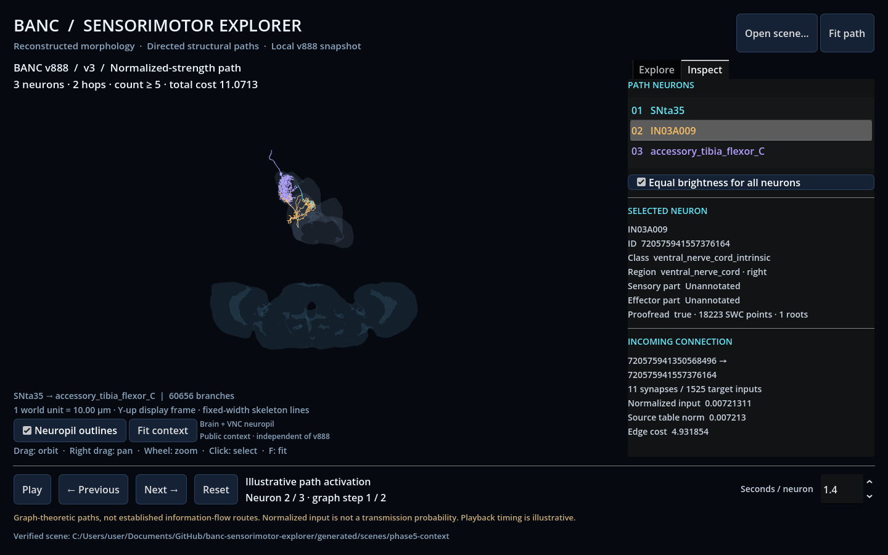

# Brain and VNC spatial context

Phase 5 adds two optional public neuropil outlines. They provide spatial context
for selected reconstructed neurons, not cell membranes, neuron meshes, synapse
locations or a complete CNS envelope. No cervical-connective surface is fabricated.

```powershell
uv run banc-explorer morphology context-fetch
uv run banc-explorer scene export --path generated/phase1-demo/normalized.json --output generated/scenes/context-demo --include-context --offline
.\scripts\run_viewer.ps1 -Scene generated/scenes/context-demo
```

The first command downloads six bounded files into `.cache/banc/v888/context/`.
The directory is organizational: these assets are **not materialization v888**.
`context-fetch --offline` verifies them without network access; `--refresh`
explicitly replaces the cached assets. Scene export also fetches them when
`--include-context` is supplied without `--offline`.

In the local API's Explore tab, check **Include brain / VNC outlines** before
calculating. It is off by default. **Fetch missing scene assets** authorizes
downloads of selected SWCs and these outlines; it is off by default and disabled
on an offline server. Missing context fails the job with a cache-recovery message.
An already displayed scene remains available after any failed replacement.

**Neuropil outlines** toggles visibility, **Fit context** frames the entire path
and both regions, and **Fit path** returns to the selected morphology. The initial
camera fits the path. Context geometry does not participate in neuron picking or
illustrative activation. Surfaces are deliberately faint and translucent.

## Verified sources and coordinates

The [BANC data documentation](https://github.com/sjcabs/fly_connectome_data_tutorial/blob/main/data/dataset_documentation/banc_data.md)
identifies the public `region_outlines/` source. The exact selected IDs/names come
from its [segment properties](https://storage.googleapis.com/lee-lab_brain-and-nerve-cord-fly-connectome/region_outlines/segment_properties/info).
They are not labels inferred from appearance.

| Region ID | Public label | Vertices | Triangles | Cached fragment bytes |
|---|---|---:|---:|---:|
| 3 | BANC_brain_neuropil | 4,507 | 9,090 | 163,168 |
| 4 | BANC_vnc_neuropil | 2,215 | 4,465 | 80,164 |

Observed 2026-10-02, the two fragments plus catalog/labels/manifests total
**258,825 bytes** locally, excluding receipts. GCS lists 148,323 bytes for the two
stored gzip fragments; its default response was decompressed. The reader accepts
either representation and bounds both transfer and decompression at 5 MB per file
(six files maximum). No additional Python dependency is needed.

The source is Neuroglancer's [legacy single-resolution mesh format](https://github.com/google/neuroglancer/blob/master/src/datasource/precomputed/meshes.md#legacy-single-resolution-mesh-format):
little-endian vertex count, interleaved float32 xyz positions in global nanometers,
then uint32 triangle indices. The provider only accepts the two verified
single-fragment manifests. Unexpected fragment paths/layouts are rejected.
The volume's 8/8/45 resolution is **not** multiplied into already-nm vertices.
No JRC2018 atlas transform or arbitrary alignment is applied.

Observed raw bounding boxes (nm):

| Region | Minimum xyz | Maximum xyz |
|---|---|---|
| Brain | (105875.55, 44969.26, 9784.61) | (883242.88, 305800.94, 276369.94) |
| VNC | (347739.25, 549945.63, 68574.91) | (644044.31, 1017764.13, 302378.66) |

These use the same BANC frame as the v888 full SWCs. Both outlines receive the
path's common origin, `(x,y,z) → (x,-z,y)` rotation and uniform scale. The real demo
visually overlaps the VNC region; this check is spatial context, not a quantitative
registration/containment validation. Neurites may extend beyond a neuropil surface.
Screen up/down does not assert anatomical anterior/dorsal orientation.

## Provenance and contract

Outline fragments have GCS generations `1727283814646787` (brain) and
`1727283821292650` (VNC). Their local fragment SHA-256 values are respectively
`87418c7cb33429e99d55ed51f81dde49daea51dcef3d384ceaed33e58299b42c` and
`e6f0997a833992c14bcac131321bd0dd3c899781ba4a0e5fd93c3538ce964124`.
Catalog/labels/manifests have separate receipts; all four sources for each region
are recorded with URL, generation, byte count and hash. The provider sets
`source_materialization: null` and visibly distinguishes this context from v888.
No claim is made that the independently updated region files reproduce a v888 atlas.

With context, `path.json` is **skeleton_scene schema 2** and adds two ordered
`context` references to `context/{3,4}.json`. Each geometry has its own schema 1,
`artifact_type: neuropil_outline`, region ID, world-unit points and triangles.
References include geometry hashes, counts and bounds. The top-level manifest,
original graph path and skeleton geometries remain schema 1. Scene bounds still
describe neurons; each outline has separate bounds for the context camera.

Without context, export preserves the original schema-1 shape (no added context
field). Current Python/Godot readers accept both scene versions. Earlier readers
reject schema 2 rather than silently omitting context. Python and Godot check
hashes, region identity, triangle indices, units and bounds before displaying a
bundle. All geometry remains local and excluded from Git. The HTML inspection aid
continues to show skeletons only after validating the entire bundle.



Synapse-level evidence, raw EM, full neuron surfaces and finer region selection
remain separate work. These outlines do not alter graph costs or path selection.
