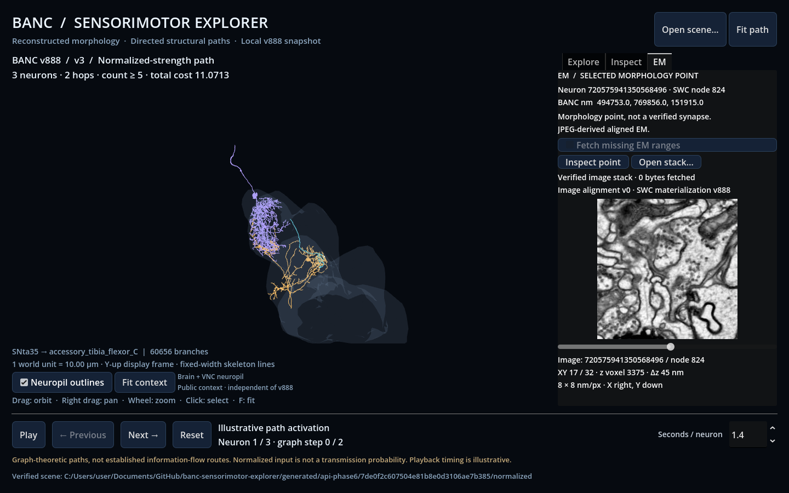

# Selected-point EM context (Phase 6A)

Godot can inspect a small public aligned electron-microscopy image stack around
an exact SWC node. The point belongs to a reconstructed v888 neuron; it is **not
a verified synapse position**. This milestone supplies image context. The planned
Phase 6 connection → synapse coordinates → EM evidence workflow is still pending.



## Run in Godot

Stop an existing API process before changing its Python environment on Windows.
After the core README bootstrap:

```powershell
uv sync --locked --extra api --extra em
uv run --extra api --extra em banc-explorer serve
```

In another terminal, run `./scripts/run_viewer.ps1 -ApiUrl http://127.0.0.1:8767`.
Calculate a path in Explore, allowing selected scene assets if their SWCs are not
cached. Then:

1. Click a skeleton to select a neuron and the nearest projected SWC node. A white
   marker identifies the point. List selection initially chooses the middle array
   sample; this is neither a soma estimate nor a synapse estimate. Overlapping
   branches can make screen-space picking ambiguous, so inspect the shown node ID.
2. Open **EM**. It shows the exact neuron/node IDs and BANC coordinates in nm.
3. Enable **Fetch missing EM ranges** for an uncached point. This is off by default
   and disabled by `serve --offline`. EM requests always reuse an existing verified
   SWC; its hash must match the displayed scene.
4. Choose **Inspect point**. After validation, move the slice slider through the
   XY stack. Image labels identify its own neuron/node even if selection changes.
   X increases to the right, Y downward; Z changes with the slider. These image axes
   do not inherit Godot's display rotation and are not anatomical axis labels.

Failures retain the last valid image and scene. **Open stack…** loads a saved
`roi.json` without a running API. A file viewer can also use `--em-dir <directory>`
after the Godot command separator. API jobs save under
`generated/api/<job-id>/em/` unless `serve --output` selects a different root.

Only Pillow is added by the optional `em` extra. The core application and saved
Godot image viewer require no CAVE credentials or cloud-volume installation.

## CLI and reproducible example

The current real demo sensory neuron is `720575941350568496`; SWC node `824` is at
`(494753, 769856, 151915)` nm. This node was read from the actual cached skeleton.
Export the README's scene first, then:

```powershell
uv run --extra em banc-explorer em fetch --scene generated/scenes/phase3-demo --neuron-id 720575941350568496 --node-id 824 --output generated/em/demo
```

Add `--offline` to require cached ranges. Use a new output directory each time;
existing outputs are protected. `--size-xy` controls both XY dimensions, `--depth`
controls Z, and `--mip` selects the verified source scale (0–6). The API can also
request unequal X/Y dimensions. Missing/out-of-bounds imagery is an error; the
provider never silently pads missing chunks with black pixels.

Default size is **256 × 256 × 32 voxels**, at MIP 0 **8 × 8 × 45 nm/voxel**.
Maximum size is 256 × 256 × 64. These are aligned JPEG-derived images, not
lossless original detector pixels. Higher MIPs coarsen XY; Z spacing stays 45 nm.

## Access and provenance

The [official BANC viewer](https://ng.banc.community/view) identifies the anonymous
public source `precomputed://gs://seunglab_lee_fly_cns_001_alignment/aligned/v0`.
Its [image metadata](https://storage.googleapis.com/seunglab_lee_fly_cns_001_alignment/aligned/v0/info)
was checked on 2026-10-02. This image alignment is **v0**, independent of CAVE
materialization **v888** for the SWC. No image materialization number is invented.

The provider supports this specific verified precomputed layout: 128 × 128 × 16
JPEG chunks, compressed Morton chunk IDs, identity-hashed uint64 sharding, and
gzip minishard indices. It reads only index and selected chunk byte ranges:

- At most 2 MB per range, 32 MB downloaded per operation, 64 selected chunks,
  200 distinct ranges and 64 MB cumulative bytes accessed.
- `/info` is capped at 100 KB; decoded minishard indices at 4 MB.
- HTTP ranges require status 206 and exact Content-Range. A server returning a
  whole shard is rejected before reading the body. No full shard/volume fallback.
- ETag/generation must agree within each source object; later requests use
  If-Match. Cache bytes have SHA-256 receipts, reused offline only after validation.
- Source URLs are fixed. A changed format is rejected instead of guessed.

Cache files live in `.cache/banc/v888/em/ranges/`; the directory groups project
assets but does not assign v888 to the imagery. The manifest explicitly keeps the
image source, image materialization (null), SWC source/hash, selected node/nm point,
source metadata, range URLs/offsets/ETags/generations/hashes, software version,
timestamp, transfer count and per-PNG hashes. Output is a portable `roi.json` plus
small grayscale PNG slices, validated by both Python and Godot.

Voxel center selection is `floor(center_nm / resolution_nm)` on each axis; the
crop origin subtracts `size // 2`. Arrays are Z/Y/X with X fastest. Each PNG is XY
at one global Z index. The Python scene transform is inverted once for CLI scene
selection; the API resolves the node directly from its hash-verified source SWC.

Implementation follows the primary Neuroglancer
[volume format](https://github.com/google/neuroglancer/blob/master/src/datasource/precomputed/volume.md)
and [sharding format](https://github.com/google/neuroglancer/blob/master/src/datasource/precomputed/sharded.md).

## Why selected-synapse evidence remains pending

We inspected only the footer of the official
`compiled_data/banc_888/banc_888_synapses_v3_enriched.parquet` object. Its observed
size was **19,733,123,829 bytes** (generation `1786578708197684`), with 198,816,365
rows in 1,989 row groups. Footer metadata cost about 8.03 MB to retrieve; no
synapse-row data pages were fetched.

The demo's selected pre/post pair survived min/max pruning in all 1,989 groups.
Projected ID/pre/post/XYZ columns would still read about **7.76 GB** of compressed
data. Predicate pushdown alone therefore does not make this specific table a small
query. That scan was not performed. A public bounded lookup, a separately prepared
small v3 subset, or an optional verified CAVE provider is needed before associating
actual synapses with the graph edge. Other detector versions must remain labeled.

## Verification and limits

Synthetic tests check asymmetric Morton encoding, index offsets, chunk crossings,
axis/crop correctness, bounded decompression, source-version changes, HTTP range
rejection, offline/cache integrity, exact SWC selection and image contract errors.
Optional Godot tests exercise the loader and a real loopback API with synthetic
data. CI installs `api` and `em`; it does not fetch public datasets.

The real selected-point demonstration used 1,682,385 cached EM bytes including
metadata/index ranges across the probe and default ROI, then reloaded with zero
additional transfer. A GPU UI/API smoke run passed 29 automated checks and its
screenshot was inspected. This is app-input automation, not a manual OS-input test.
Only XY slices are implemented; there is no segmentation overlay, inferred synapse
marker, volume rendering or biological activity simulation.
