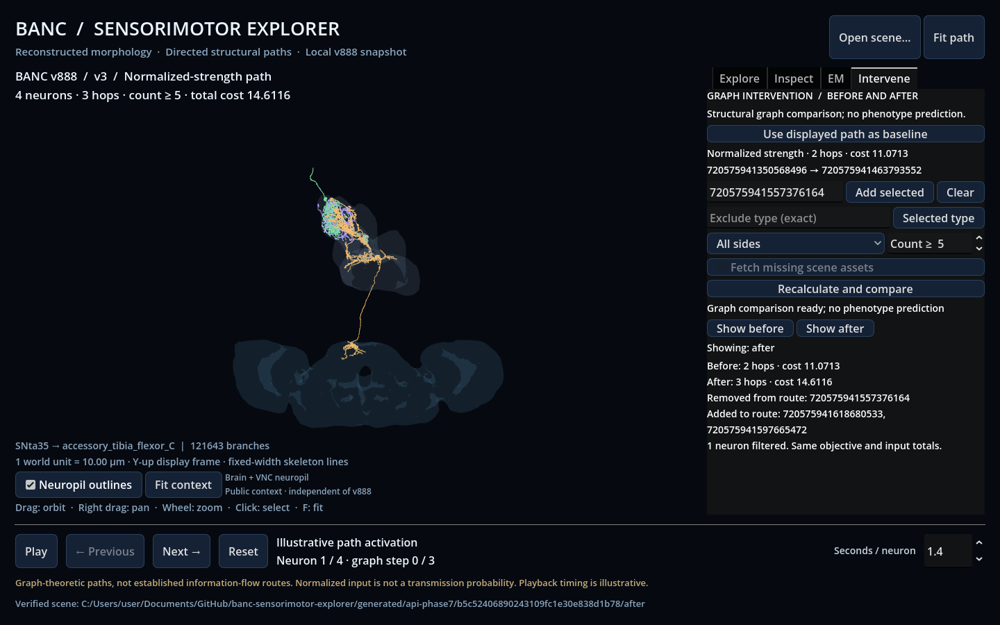

# Graph intervention playground (Phase 7)

Compare a baseline route against a graph with excluded neurons, an excluded cell
type, a changed edge threshold or a side restriction. Results describe structural
graph paths, **not predicted experimental phenotypes or biological rerouting**.



## Godot workflow

Start the [local API](local-api.md), then open the viewer. No new optional package
is needed beyond `api`; `em` remains independently optional.

1. Calculate a path in **Explore** and display the desired objective. Open
   **Intervene** and click **Use displayed path as baseline**. The pinned baseline
   identifies its objective, cost, endpoints and source scene.
2. Select a neuron through the viewport or Inspect list. Return to Intervene and
   choose **Add selected** to add its exact ID to the exclusion field. Alternatively
   enter comma-separated IDs (up to 40). Clear removes those explicit exclusions.
3. Optionally enter an exact `cell_type`, or click **Selected type**. This excludes
   every neuron with that metadata value, not just the selected neuron. Empty text
   disables the type filter. The API/CLI also accept multiple type labels.
4. Set minimum count and/or choose Left only / Right only. Side restriction applies
   to **every vertex, including source and target**. Missing/unknown side is excluded.
5. Click **Recalculate and compare**. Hops, costs and removed/added route IDs appear.
   **Show before** and **Show after** switch one viewport between validated scenes;
   the panel labels which one is currently displayed.

Both paths use the same source/target, connectivity version, source hashes, path
objective and normalization definition. Original `pre_count`/`post_count` values
are preserved. Interventions never renormalize remaining input contributions.
Costs are compared within one objective; minimum-hop and normalized-strength costs
are different quantities. Identical results are labeled as the same sequence.

Rules are applied together to the unmodified source graph for each query; they do
not accumulate across clicks. Pinning a new baseline resets the rules. Editing a
rule clears the old comparison while retaining the current scene, labeled as
another scene when it no longer matches the valid before/after pair.

An excluded endpoint or unreachable target produces a successful **no-path
comparison**, with null after cost and no after scene. It does not fabricate an
empty route or equate no path with a biological loss of behavior. The before scene
remains available. If a reachable result lacks cached SWCs, the graph comparison
is still saved and the missing-morphology error is shown. Enable **Fetch missing
scene assets** to fetch only that path's SWCs under existing download budgets.

The interactive baseline must be a completed ordinary path job still in this
server's 32-job history. Restarting the API or evicting that job requires calculating
a new baseline. File-only paths can be compared with the CLI below. A saved after
scene remains compatible with the ordinary offline viewer.

## CLI

This command reads existing source caches and never downloads:

```powershell
uv run banc-explorer path intervene --baseline generated/phase1-demo/normalized.json --exclude-id 720575941557376164 --output generated/interventions/remove-IN03A009
```

Repeat `--exclude-id` or `--exclude-cell-type` for multiple exclusions. Add
`--min-synapse-count 10` or `--side right`. The default threshold comes from the
baseline. Use the same v2/v3 config as the baseline, via `--config`, when needed.
CLI rule lists define the entire new intervention, replacing any baseline filter
choices rather than implicitly merging them. Source hashes must still match.

The new directory contains a validated `comparison.json` with complete before
path, rules, after query manifest and optional after path. `after.json` is written
only when reachable, and can be exported using the existing `scene export --path`
command. Existing output directories are protected. Every successful result,
including no path, records source/version/cost/filter provenance.

## Verified real example

At v888/v3, threshold 5, the normalized-strength baseline was:

`SNta35 → IN03A009 → accessory_tibia_flexor_C`

Removing `IN03A009` (`720575941557376164`) produced:

`SNta35 → AN05B009 → IN03A007 → accessory_tibia_flexor_C`

| Quantity | Before | After |
|---|---:|---:|
| Hops | 2 | 3 |
| Normalized-strength cost | 11.0713078411 | 14.6115986170 |
| Reconstructed neurons | 3 | 4 |

The added IDs are `720575941618680533` and `720575941597665472`. These were derived
from the actual graph and metadata. Their two SWCs totaled **5,349,296 bytes** and
are cached under `.cache/banc/v888/skeletons/`. The after scene has 121,647 nodes /
121,643 branches. No edge table, EM volume, synapse table or neuron mesh was fetched.
In a separate right-only check, 102,061 vertices were excluded and the original
two-hop baseline remained unchanged. This does not imply lateralized behavior.

## Implementation and verification

The Python graph layer filters verified edges while retaining isolated vertices,
original input totals and the raw-source coverage report. One unmodified graph can
be reused, with a temporary filtered graph during comparison. Lowering the threshold
below the cached graph rebuilds from source data. The cached baseline is never
mutated. The same background worker handles path, EM and intervention jobs; it
rejects simultaneous submissions instead of accumulating work.

`POST /interventions/path` accepts `baseline_job_id`, `mode`, `min_synapse_count`,
`excluded_neurons`, `excluded_cell_types`, `side` (null/left/right) and
`allow_downloads`. `GET /interventions/{job_id}` returns status and compact results:
before/after hops and costs, reachability/reason, path ID changes, filtered-neuron
count, report path, before scene and optional after scene/error. All IDs are strings.
The existing loopback, 4 KiB request, output-root and download restrictions apply.

Tests cover both objectives, neuron/type/side/threshold filters, unannotated isolated
vertices, unchanged input totals, source mismatches, no-path manifests, baseline
immutability, CLI output protection and missing-morphology recovery. Godot uses a
real loopback server with synthetic data in optional engine tests. A real GPU run
passed 34 app-input checks, including before/after switching and no-path handling;
the screenshot was visually inspected. This was not a manual OS-input test.

Comparison currently switches scenes and refits the camera; there is no simultaneous
overlay or pair of synchronized cameras. Exclusions are whole-neuron graph operations,
not synapse edits. Selecting verified synapse coordinates remains a separate pending
part of Phase 6, as documented in [EM limitations](em.md).
